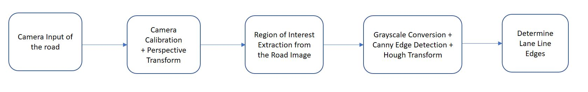

# SSW690-Project
Repository for SSW690 Project

Team Members:
* Belorkar, Sapana
* Burbidge, Adam
* Roseberry, Keith
* Varadaraju, Rakshith

References/Links:
* [OpenCV Library](https://opencv.org/)
* [OpenCV on Android](https://opencv.org/platforms/android/)
* [OpenCV on Raspberry Pi](https://www.pyimagesearch.com/2017/09/04/raspbian-stretch-install-opencv-3-python-on-your-raspberry-pi/)
* Article: [Three Sensor Types Drive Autonomous Vehicles](https://www.sensorsmag.com/components/three-sensor-types-drive-autonomous-vehicles)
* Article: [Smartphone based mass traffic sign recognition for real-time navigation maps enhancement](https://ieeexplore.ieee.org/document/7975125/)
* Article: [Lane Departure and Obstacle Detection Algorithm for use in an Automotive Environment](http://citeseerx.ist.psu.edu/viewdoc/download?doi=10.1.1.140.4306&rep=rep1&type=pdf)

### Lane Departure Warning System (LDWS) Functionality

From [Wikipedia](https://en.wikipedia.org/wiki/Lane_departure_warning_system): A lane detection system uses the principle of [Hough transform](https://en.wikipedia.org/wiki/Hough_transform) and [Canny edge detector](https://en.wikipedia.org/wiki/Canny_edge_detector) to detect lane lines from realtime camera images fed from the front-end camera of the automobile.

### Obstacle Detection Functionality

From [ExtremeTech](https://www.extremetech.com/extreme/189486-how-googles-self-driving-cars-detect-and-avoid-obstacles): Google mounts regular cameras around the exterior of the car in pairs with a small separation between them. The overlapping fields of view create a parallax not unlike your own eyes that allow the system to track an object’s distance in real time. As long as it has been spotted by more than one camera, the car knows where it is. These stereo cameras have a 50-degree field of view, but they’re only accurate up to about 30 meters.

*Barrier: Most mobile phones only have one camera and even if dual cameras are available, the separation between the cameras will not be sufficient to detect an object. Object detection is enhanced with non-visual sensors such as LIDAR, which a mobile phone will not have.*

### Traffic Sign Recognition Functionality

From [Wikipedia](https://en.wikipedia.org/wiki/Traffic-sign_recognition): There are diverse algorithms for traffic-sign recognition. Common ones are those based on the shape of the sign board. Typical sign board shapes like hexagons, circles, and rectangles define different types of signs, which can be used for classification. Other major algorithms for character recognition includes [Haar-like features](https://en.wikipedia.org/wiki/Haar-like_feature), Freeman [Chain code](https://en.wikipedia.org/wiki/Chain_code), AdaBoost detection and deep learning neural networks methods. Haar-like features can be used to create cascaded classifiers which can then help detect the sign board characters. Polygonal approximation of digital curves using [Ramer–Douglas–Peucker algorithm](https://en.wikipedia.org/wiki/Ramer%E2%80%93Douglas%E2%80%93Peucker_algorithm) can be used to detect the shape of the sign boards and methods like [Support Vector Machines](https://en.wikipedia.org/wiki/Support_Vector_Machines) and Byte-MCT with an [AdaBoost](https://en.wikipedia.org/wiki/AdaBoost) classifier has been used in one of the methods to detect traffic signs.

