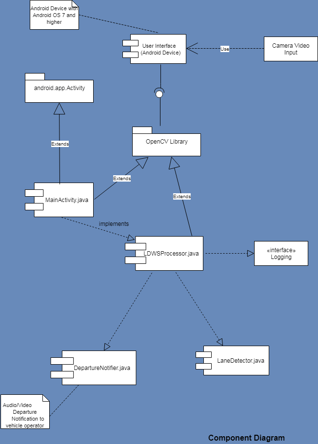

# Architecture Description

## 1. Scope
This Architecture Description provides a high level overview and details on the architecture of the Back Seat Driver application for the Android platform. The Back Seat Driver application will utilize the smart phone's camera to process a video of the oncoming road/surface in order to detect the travel lane and warn the operator when the vehicle is departing the lane (i.e., Lane Departure Warning System, or LDWS). This document describes the internal organization of the application from multiple perspectives to aid in the understanding, development, testing and maintenance of the application.

## 2. Architecture Goals & Constraints
The architecture is largely constrained by the Android operating system and application environment, and the OpenCV library that will be heavily leveraged to perform video capture, processing and output. In addition to these constraints, the Back Seat Driver team has established the following goals.

  * __Extensibility__: The architecture should facilitate not only quick delivery of a LDWS function, but allow for developers to quickly and easily extend the functionality for other purposes. Other purposes could include traffic sign recognition and forward collision alerting.
  * __Modularity__: The architecture should support adequate separation of functionality and responsibility such that the development and testing can be partitioned and completed independently from other parts of the application.
  * __Performance__: The architecture should optimize performance above other quality characteristics. This is because a poor performing application will fail to achieve the desired functionality, regardless of whether extensibility and modularity have been achieved.

## 3. Logical Architecture
In Progress: Assigned to Keith

The following diagram depicts the logical architecture of the software that operates the Back Seat Driver and LDWS functionality. The system utilizes a layered architecture where interaction among the architectural elements are strictly with the layers above and below. The architecture significantly leverages the standard Android application environment and the services provided by the OpenCV library. These services in libraries, then, execute on top of the Android operating system. Coupled with the Android operating system are specific drivers for hardware devices, in particular the speaker for audio notifications, the screen for visual output, the touchpad for user interaction, storage for capturing log messages and functional data, and the camera for video input.

### 3.1 Back Seat Driver Application Architecture

The following diagram depicts the internal architecture of the Back Seat Driver application.

#### 3.1.1 MainActivity Class

The MainActivity class is derived from the android.app.Activity class and provides the application framework and fundamental operation. This includes initializing the services and libraries needed to perform processing, establishing application run-time characteristics such as "keep screen on" and ensuring that everything is shut down correctly when the application is terminated. The MainActivity class will vector processing to the LDWSProcessor class in order to invoke the lane departure warning functionality.

#### 3.1.2 LDWSProcessor Class

The LDWSProcessor class is the main controller for the Lane Departure Warning function. It contains the main algorithms to determine the lane of travel and whether the vehicle is on a trajectory to depart the lane of travel. It is invoked by the MainActivity class upon application startup or activation by the user and is responsible for intializing the appropriate resources to perform the function. This includes initializing the OpenCV library modules, activating the device's camera and establishing a logging mechanism. The LDWSProcessorClass leverages two additional classes for complete functionality - the LaneDetector class, which processes images to determine the lane of travel and the DepartureNotifier class, which audibly and possibly visually notifies the driver of a lane departure warning.

#### 3.1.3 LaneDetector Class

The LaneDetector class is responsible for performing image and algorithmic processing in order to detect the lane markers or boundaries of the travel lane. This class leverages the OpenCV library modules to perform filtering and processing such as applying a Gaussian filter, Hough transformation and invoking a Canny Edge Detector. The LaneDetector class is invoked by the LDWSProcessor class when a new frame of video is ready for processing. The output provided back to the LaneDetector class is a set of data structures that represent the detected lane of travel.

#### 3.1.4 DepartureNotifier Class

The DepartureNotifier class is the function that performs audible and possibly visual notification of a lane departure warning. The class interfaces with the Android's speaker device interface to issue the audible warning. If a visual notification is implemented, the class will invoke another Activity to overlay the visual warning on the application window. The DepartureNotifier class is invoked by the LDWSProcessor class when a warning needs to be issued; it is otherwise idle.

### 3.2 Correlation of Architecture to Goals

__Extensibility__ is accomlished by allowing the MainActivity to invoke additional "processor" classes, operating in parallel to the LDWSProcess class. For example, if a traffic sign recognition function is desired to be added, a new TrafficSignProcessor class (and associated classes) can be created. The MainActivity would then be extended to invoke the TrafficSignalProcessor class in addition to the LDWSProcessor class.

__Modularity__ is accomlished by partitioning the major sub-functions of the application functionality into separate classes. It is possible to have separate team members working independently on the LDWSProcessor, LaneDetector and DepartureNotifier classes without signficant impact to each other, as long as the public interfaces to the classes are well-designed and strictly enforced.

__Performance__ is accomplished by streamlining the processing into a serial/pipeline methodology whereby the MainActivity invokes the LDWSProcessor class, which then invokes the LaneDeparture class and when necessary the DepartureNotifier class. Performance of each of these sub-functions may then be easily measured and corrective action taken if needed to optimize their execution.

## 4. Process Architecture
TBD: Assigned to Adam

## 5. Development Architecture
TBD: Assigned to Sapana

The following diagram depicts the components involved in the Back Seat Driver application.

## 6. Scenarios
TBD: Assigned to Rak

