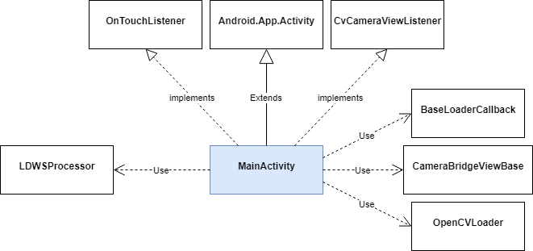

# Design Description

This document presents the high level design of the Back Seat Driver application. The intent is to provide sufficient details such that consistency and organization is established for the implementation to be successful.

Warning: This document is a "living" document and will be updated as the Back Seat Driver application prototype evolves.

## 1. References

[Architecture Description](ArchitectureDescription.md): Presents the architecture of the Back Seat Driver application.

## 2. Design

The design of the Back Seat Driver application is a decomposition of the architectural elements identifed in the [Architecture Description](ArchitectureDescription.md) document

### 2.1 LDWSProcessor

TBD

### 2.2 LaneDetector

TBD

### 2.3 DepartureNotifier

TBD

### 2.4 MainActivity

Responsibilities:
  * Start up and shut down the Back Seat Driver application.
  * Load and initialize the OpenCV library and touch/camera interfaces.
  * Invoke the LDWSProcessor to perform lane departure warning.

The following diagram depicts the design of the MainActivity class.

The MainActivity class extends the base Android.App.Activity class to form the basis of an Android application. It implements the OnTouchListener and CvCameraViewListener interfaces to interface to the touchpad and the camera devices. It uses the facilities of the BaseLoaderCallback and OpenCVLoader classes to perform loading of the OpenCV library, specifically loading the library from an installed location or from within the application itself. The CameraBridgeViewBase class from OpenCV is used to interface with the camera device, which allows the application to control the enabling/disabling of the camera video feed and to obtain characteristics of the video frame to be processed. Finally, it uses the LDWSProcessor class to invoke the specialized functionality of the Lane Departure Warning functionality.

## 3. Summary

TBD
